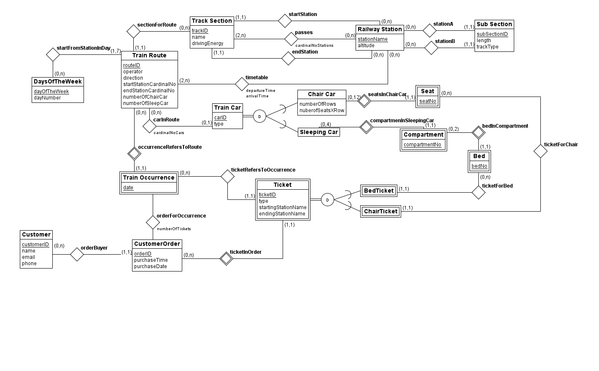

The following repository is the result of a Project in the course TDT4145 at Norwegian University of Science And Technology.

The authors are Andrea Ritossa and Mali Faksvåg Kippernes

The purpose is to add an user interface to the database descripted in the following EER Model:

